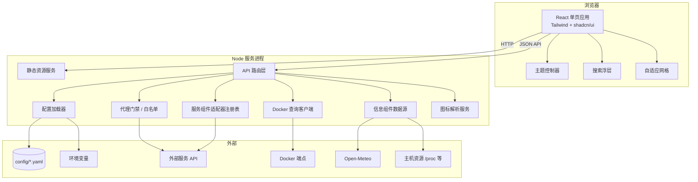
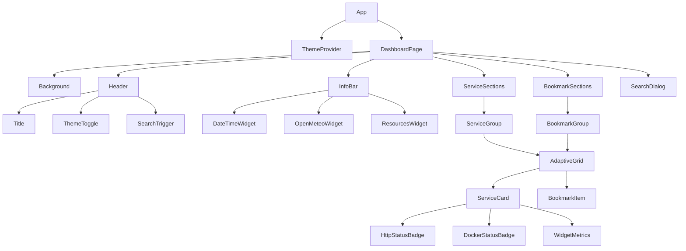
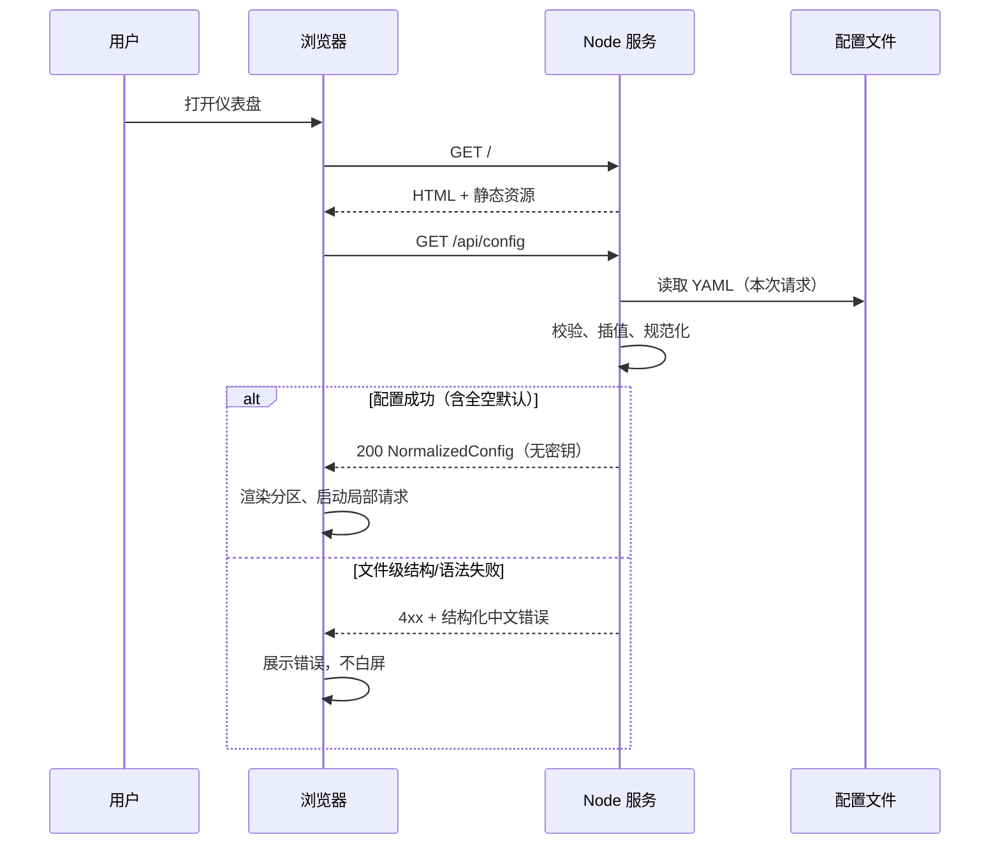
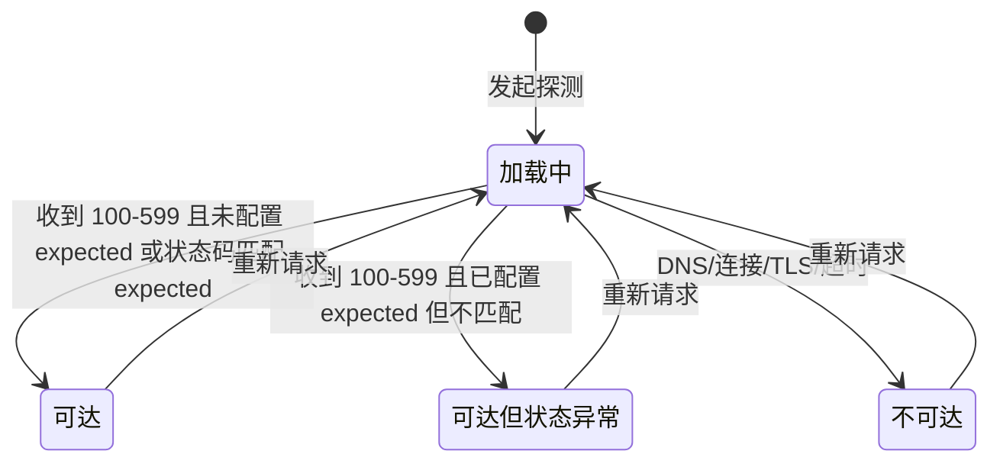
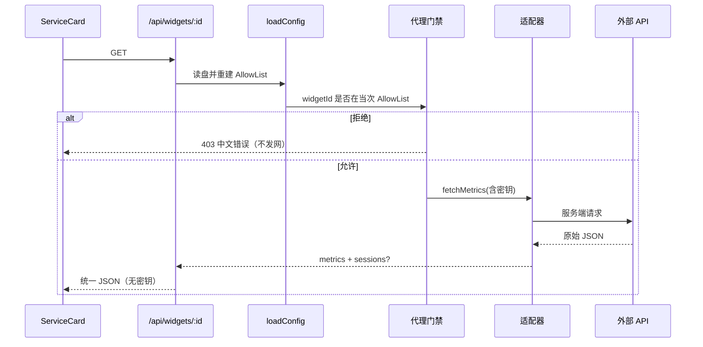
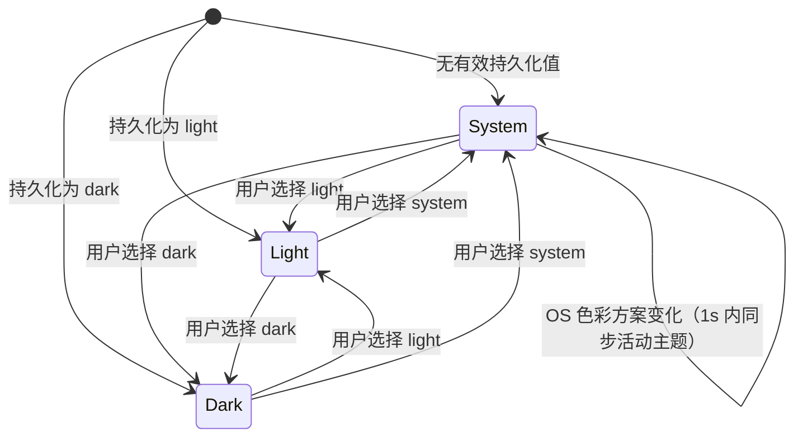
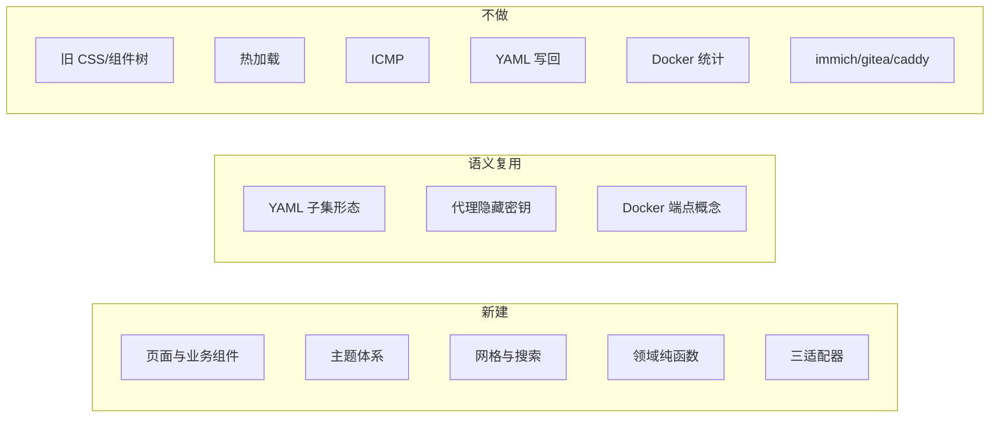

# 设计文档

## 概述

本设计描述如何在当前工作区（基于 Homepage 能力模型、当前几乎为空的 monorepo）用 **React + Tailwind CSS + shadcn/ui** 全量重建自托管仪表盘。实施方式是建立**全新精简的页面与组件树**，而不是逐个替换旧 UI，也不延续上游 Homepage 的组件结构、CSS 或视觉风格。

第一阶段目标：

- 配置驱动的服务分组、书签、信息组件与限定类型的服务组件
- 三态主题（`system` / `light` / `dark`）与 OS 实时跟随
- HTTP 在线探测（可达 / 可达但状态异常 / 不可达）与 Docker 运行状态（不含 CPU/内存统计）
- 服务端代理白名单、密钥永不进入浏览器
- 快捷搜索与自适应网格（最大列数 + 最小卡片宽度）
- 可局域网 HTTP 访问的生产部署产物

**设计原则：**

1. **前端全新、后端能力按需复用**：页面、布局、主题与业务组件全部新建；仅复用或重写「配置加载、代理、Docker 查询、图标」等有价值的服务端能力语义，不恢复热加载、ICMP、YAML 写回等已推迟能力。
2. **故障局部化**：每个异步数据源独立加载/错误/空状态，单点失败不拖垮整页。
3. **安全默认**：密钥仅服务端解析；代理仅允许规范化配置中已登记目标；每次数据 API 请求均从磁盘重建允许列表后再鉴权。
4. **可测试的纯逻辑下沉**：排序、搜索匹配、列数计算、探测状态分类、主题解析等放入无 UI 纯函数，便于属性测试与单测。

---

## 架构

### 总体架构

采用 **BFF（Backend for Frontend）单进程** 架构：Node 服务同时提供静态前端资源与 JSON API。浏览器只与本机 API 通信，从不直连外部服务、Docker 或携带密钥的端点。



### 技术栈（第一阶段锁定）

| 层 | 选型 | 说明 |
| --- | --- | --- |
| 包管理与工作区 | **pnpm workspace** | 默认 monorepo 布局 |
| 前端应用 | `apps/web`：React + **Vite** + Tailwind CSS + shadcn/ui | 全新 SPA，不继承上游页面结构 |
| 领域与配置 | `packages/domain`、`packages/config` | 纯逻辑与 YAML 规范化，无 I/O 或仅文件读 |
| 适配器 | `packages/adapters` | qbittorrent / emby / customapi |
| 服务端 | `packages/server`：**Hono**（或等价 Node `http` 薄封装） | 提供全部 `/api/*`，并托管 `apps/web` 的 `dist` 静态资源 |
| 容器 | 可选 `Dockerfile` | 非强制；有则挂载 config 目录 |

**逻辑边界（无论物理包如何拆分都必须保持）：**

| 逻辑边界 | 默认包 | 职责 |
| --- | --- | --- |
| 展示层 | `apps/web` | 页面布局、卡片、主题、搜索、中文状态文案 |
| 前端状态层 | `apps/web` | 配置快照、各卡片异步状态、主题持久化（React Query / SWR + 轻量 context） |
| API / 基础设施 | `packages/server` | 路由、代理门禁、Docker、主机指标、图标、静态托管 |
| 领域层 | `packages/domain` | 排序、探测分类、网格算法、指标类型、URL 判定 |
| 配置层 | `packages/config` | 读 YAML、`${ENV}` 插值、校验子集、输出 `NormalizedConfig` + `AllowList` |
| 适配器层 | `packages/adapters` | 外部 API → 统一指标 |

允许在实现时采用**等价的单包目录布局**，但必须保留上述逻辑边界（纯领域 / 配置 / 适配器 / 服务端 I/O / 前端 UI 分离），以便测试与后续扩展。不得在文档或实现中再保留「Vite 或 Next」「Hono 或 Fastify」等未决摇摆表述。

### 部署形态

```mermaid
flowchart LR
  Build[pnpm build] --> Dist[apps/web/dist 静态资源]
  Build --> Server[packages/server 入口]
  Dist --> Image[容器镜像可选]
  Server --> Image
  Image -->|挂载| Cfg[/config 目录]
  Image -->|可选| Sock[/var/run/docker.sock]
  Client[局域网浏览器] -->|HTTP :端口| Image
```

生产产物要求：

- 单命令启动 Node 服务（或 Docker 镜像），**无需**开发服务器
- 绑定 `0.0.0.0`（或可配置）以便局域网访问
- 配置目录默认可挂载路径（如 `/app/config` 或项目 `config/`）
- `packages/server` 在生产模式同时服务 `/api/*` 与前端静态资源

### 关键设计决策

| 决策 | 选择 | 理由 |
| --- | --- | --- |
| 前端框架 | React SPA + Vite（`apps/web`） | 全新组件树；与 shadcn/ui 生态匹配 |
| UI 基元 | shadcn/ui + Tailwind + CSS 变量 | 对话框/输入/浮层用基元，业务卡片用 Tailwind 定制 |
| HTTP 框架 | Hono（`packages/server`） | 轻量、类型友好；亦可底层用 Node `http`，对外契约不变 |
| 配置写回 | 不做 | 第一阶段非目标 |
| 热加载 | 不做；UI 快照仅整页刷新更新；数据 API 每次读盘 | 见「AllowList 生命周期」 |
| 代理模型 | 每次数据 API 请求 `loadConfig()` → 重建 AllowList → 鉴权 | 避免内存白名单与磁盘漂移 |
| 指标模型 | 统一 `Metric[]`，适配器服务端转换 | 前端不依赖第三方响应结构 |
| 与上游关系 | 语义参考、代码不强制同步 | 不保证无冲突合并 |
| CSP / Host 允许列表 | **可选加固**，非第一阶段验收门禁 | 文档建议生产可配，但不阻塞验收 |

---

## 组件与模块

### 仓库目录规划（默认 monorepo）

```text
/
├── apps/
│   └── web/                      # React + Vite + Tailwind + shadcn/ui
│       ├── src/
│       │   ├── app/              # 根布局、入口页
│       │   ├── components/
│       │   │   ├── ui/           # shadcn/ui 基元
│       │   │   ├── layout/       # Header、背景、分区
│       │   │   ├── services/     # 服务分组与卡片
│       │   │   ├── bookmarks/    # 书签分组与条目
│       │   │   ├── info/         # datetime / openmeteo / resources
│       │   │   ├── widgets/      # 服务组件展示（消费统一指标）
│       │   │   ├── search/       # 搜索浮层
│       │   │   └── theme/        # 主题切换
│       │   ├── hooks/
│       │   ├── lib/              # 纯函数：search、grid、theme
│       │   └── styles/           # 全局 CSS 变量（亮/暗）
│       └── index.html
├── packages/
│   ├── config/                   # 配置加载、校验、规范化
│   ├── domain/                   # 排序、探测分类、网格、指标类型
│   ├── adapters/                 # qbittorrent / emby / customapi
│   └── server/                   # Hono：API、代理、Docker、图标、静态托管
├── config/                       # 运行时 YAML（部署挂载，不入库密钥）
├── Dockerfile                    # 可选
└── package.json                  # pnpm workspace
```

### 前端组件结构



| 组件 | 职责 |
| --- | --- |
| `DashboardPage` | 拉取规范化配置；顶层错误/加载；分区编排；空配置时展示中文空状态 |
| `ThemeProvider` | 读/写 `localStorage`；监听 `prefers-color-scheme`；应用 `class`/`data-theme` |
| `ServiceCard` | 名称、图标、描述、链接、`target`；挂载探测/Docker/指标插槽；图标失败隐藏或中性占位 |
| `BookmarkItem` | 名称、图标→abbr→首字符回退链、描述、打开链接 |
| `AdaptiveGrid` | 观测容器宽度，计算实际列数，应用 `useEqualHeights` |
| `SearchDialog` | `Ctrl/Meta+K`、列表过滤、键盘导航、Escape 关闭 |
| `Info/*` | 各自按 `infoId` 请求或本地计算；局部 loading/error |
| `InfoBar` | 信息区使用新的 shadcn 风格**分隔容器**排布各信息组件，**不**模仿上游 `boxedWidgets` 视觉 |
| `WidgetMetrics` | 渲染统一指标列表；Emby 另渲染 `sessions`；加载/错误/空/暂不支持 |
| `ErrorBoundary`（区域级） | 捕获渲染异常，显示中文错误，不白屏 |
| 分组标题 | 服务分组与书签分组均展示分组名称 |

**空状态：**

- 服务区域无任何分组或全部为空：展示中文空状态（非无说明空白）
- 书签区域同理
- 五个配置文件均缺失：`GET /api/config` 仍返回 **200** 与空仪表盘规范化配置，前端各区显示中文空状态，**不得**硬失败整页

**shadcn/ui 使用边界：**

- 使用：`Dialog`/`Command`（搜索）、`Button`、`DropdownMenu`（主题）、`Skeleton`、`Tooltip`、`Input`
- 不强制套用：服务/书签卡片外观用 Tailwind + 主题令牌手写，避免为了用 `Card` 而牺牲业务信息密度

**`headerStyle` / `language`：** 配置加载器可读入后**忽略**；界面文案固定简体中文；信息区布局由新设计决定，不实现上游 `boxedWidgets` 克隆。

### 后端模块

| 模块 | 路径建议 | 职责 |
| --- | --- | --- |
| `configLoader` / `loadConfig()` | `packages/config` | 读 5 类 YAML；`${ENV}` 密钥插值；校验子集；输出 `NormalizedConfig` + `AllowList`；**每次调用读当前磁盘** |
| `httpProbe` | `packages/domain` + server | 对允许目标发 HEAD/GET；分类状态 |
| `dockerStatus` | `packages/server` | 按命名端点查容器；映射运行/停止/不可用；路径参数须过白名单 |
| `adapterRegistry` | `packages/adapters` | 按 `type` 注册 qbittorrent/emby/customapi |
| `infoProviders` | `packages/server` | 按 `infoId` 提供 openmeteo / resources；datetime 主要由前端本地计算 |
| `iconService` | `packages/server` | 解析 mdi/si/本地/URL 图标，返回安全 URL 或 SVG |
| `proxyGate` | `packages/server` | 所有出站请求统一经**当次请求**构建的 AllowList 校验 |

### 注册表模式（可扩展且不改无关类型）

```typescript
// 概念接口（实现语言为 TypeScript）
type InfoWidgetType = "datetime" | "openmeteo" | "resources";
type ServiceWidgetType = "qbittorrent" | "emby" | "customapi";

interface ServiceWidgetAdapter {
  type: ServiceWidgetType;
  fetchMetrics(ctx: AdapterContext): Promise<ServiceWidgetResult>;
}

// 独立文件注册，新增类型只加文件 + 注册一行
const serviceAdapters = new Map<string, ServiceWidgetAdapter>();
```

非白名单 `type`：适配器查找失败 → 前端显示「暂不支持」，**代理不得发网**。

---

## 数据模型

### 配置文件子集（第一阶段）

配置加载器只处理下列文件与字段；未知字段安全忽略。

#### `settings.yaml`（子集）

| 字段 | 类型 | 说明 |
| --- | --- | --- |
| `title` | string | 去空白后非空则作为 `document.title` |
| `background` | string (URL) | 背景图；失败回退主题默认背景 |
| `layout.<GroupName>.columns` | number | **最大列数**，非强制列数 |
| `layout.<GroupName>....` | 其他 | 忽略未知 |
| `useEqualHeights` | boolean | 同行服务卡等高 |
| `language` | — | **读后忽略**；文案固定简体中文 |
| `headerStyle` | — | **读后忽略**；信息区用新分隔容器，不克隆 `boxedWidgets` |
| 其他 | — | 安全忽略 |

#### `services.yaml`（子集）

结构：有序分组数组；每组为单键对象 `{ [groupName]: ServiceItem[] }`（与上游 Homepage 习惯对齐以便迁移现有文件）。

`ServiceItem` 支持字段：

| 字段 | 说明 |
| --- | --- |
| `name` | 去空白后应非空；无效时见「无效服务条目策略」 |
| `href` | 可选；仅绝对 `http:`/`https:` 有效 |
| `target` | 可选；默认新标签 |
| `icon` | 可选；加载失败时隐藏或中性占位（不显示裂图） |
| `description` | 可选 |
| `siteMonitor` | URL 字符串或启用标志 |
| `expectedStatus` | 单码或范围（见下） |
| `probeTimeout` | 可选；**秒**，整数 **1–60**；缺省或非法则使用默认 **10** 秒 |
| `ping` | 忽略或标「暂不支持」，不影响可达性 |
| `server` / `container` | Docker 查询 |
| `showStats` | 接受但不展示统计 |
| `weight` | 数值；降序稳定排序 |
| `widget` / `widgets` | 服务组件配置（见下节 schema） |

`expectedStatus` 规范化：

- 单个：`200` 或 `"200"`
- 范围：`"200-399"` 或 `{ from: 200, to: 399 }`（实现选定一种主表示，加载时统一为内部 `{ min, max }[]`）

#### 无效服务条目策略（与书签对齐思路）

| 情况 | 行为 |
| --- | --- |
| YAML **文件级**语法错误或顶层结构非法 | `services` 解析失败 → `/api/config` 对该文件返回结构化中文错误（可与其他文件错误一并呈现）；不得静默当空文件 |
| 单条 `name` 缺失或去空白后为空 | 该条目变为**局部错误占位**（中文说明），留在原分组位置；**不**导致整份 `services.yaml` 失败 |
| `href` 无效（非绝对 http/https） | 卡片仍展示名称等；点击**不导航**；不因 href 无效而整卡删除 |
| `siteMonitor` 为 URL 但 URL 非法 | 不登记探测；若同时有有效 href 且 `siteMonitor` 仅为启用标志语义则按启用标志规则 |
| `siteMonitor: true` 但无有效 href | 不登记探测 |
| `probeTimeout` 非数字、&lt;1 或 &gt;60 | 忽略覆盖，使用默认 10 秒 |
| 单条其他字段非法 | 尽量局部降级（忽略字段或占位），不拖垮整组 |

书签侧保持既有策略：单条 name/href 无效 → 原区域局部中文错误，其余继续。

#### 服务组件 `widget` / `widgets` 配置 schema

**共存与选取规则（第一阶段）：**

1. 若同时存在 `widgets`（数组）与 `widget`（单对象），**优先使用 `widgets` 数组**，忽略顶层 `widget`。
2. 若仅有 `widget`，视为单元素列表 `[widget]`。
3. 若仅有 `widgets`，按数组顺序处理。
4. 同一服务上配置了多个组件时：第一阶段只渲染**第一个受支持类型**（`qbittorrent` | `emby` | `customapi`）的条目；其余条目标记为忽略/暂不支持，**不得**使整张服务卡失败。
5. 若第一个及后续均无受支持类型：卡片保留基础展示与链接，组件区显示「暂不支持」或安全忽略，代理不发网。

**公共字段（各类型）：**

| 字段 | 约束 |
| --- | --- |
| `type` | 必填字符串；白名单见上 |
| `url` | 绝对 `http:` / `https:` URL；登记到服务端 `AllowList.widgetTargets` |
| 密钥字段 | 下列之一或多（按类型需要）：`password`、`key`、`apiKey`、`token`；**仅当整个值**严格为 `${ENV_VAR}` 时服务端插值；插值结果与明文密钥**只进入服务端 AllowList**，绝不进入前端 `NormalizedService.widget` |

**`qbittorrent`：**

| 字段 | 说明 |
| --- | --- |
| `url` | WebUI/API 根或可访问 API 的绝对 URL |
| `username` | 可选/按上游习惯；可与密钥一并仅存服务端 |
| `password` | 密钥；整值 `${ENV}` |

适配器至少产出下载速率、上传速率（一致单位体系）。

**`emby`：**

| 字段 | 说明 |
| --- | --- |
| `url` | 服务器绝对 URL |
| `key` 或 `apiKey` | API 密钥；整值 `${ENV}` |
| 媒体库/历史等选项 | 若存在则**忽略**；第一阶段只做正在播放 |

适配器输出见「统一指标与 Emby 契约」：总会话数 + 最多 5 条 `sessions`。

**`customapi`：**

| 字段 | 说明 |
| --- | --- |
| `url` | 请求绝对 URL |
| `method` | 可选，默认 `GET` |
| `headers` | 可选；仅服务端使用；**不得**原样回传浏览器；值中的整值 `${ENV}` 可插值 |
| `mappings` | 列表，每项：`{ id?: string; label: string; field` 或 `path`: string; `format?`: string }` |

单映射失败只影响该指标，不使整个组件失败。

**密钥进入 AllowList 的路径：**

```text
YAML widget 配置
  → loadConfig() 整值 ${ENV} 插值（仅服务端）
  → 生成 widgetId，写入 AllowList.widgetTargets[widgetId]
       { type, url, secrets, options }
  → NormalizedService.widget 仅含 { type, widgetId?, unsupported? }
       绝不含 password/key/apiKey/token/username 明文或插值后密钥
```

#### `bookmarks.yaml`（子集）

有序分组；条目字段：`name`、`href`（必填绝对 URL）、`icon`、`abbr`、`description`、`target`。

单条无效 → 局部错误占位，不拖垮整文件（文件级结构错误仍失败该文件解析）。

#### `widgets.yaml`（子集）

信息组件列表，每项含 `type` 及类型专用字段；规范化时为每项分配稳定 **`infoId`**。

- `datetime`：时区 + 受支持的格式字段（见「信息组件 API 与格式」）
- `openmeteo`：`latitude`、`longitude`、`timezone`
- `resources`：cpu/memory 开关、磁盘路径列表
- 其他 `type`：忽略或「暂不支持」

#### `docker.yaml`（子集）

命名端点映射，例如：

```yaml
my-docker: unix:///var/run/docker.sock
# 或 tcp://host:2375 等受支持形式
```

仅已声明名称可被 `server` 引用。

### 五个文件均缺失

当 `settings.yaml`、`services.yaml`、`bookmarks.yaml`、`widgets.yaml`、`docker.yaml` **全部不存在**时：

- 配置加载器将各类别规范为**空配置 / 内置默认**（标题用中文默认等）
- `GET /api/config` 返回 **200** + 空仪表盘安全视图
- 前端展示中文空状态（服务区、书签区等），**不得**整页硬失败或白屏

单个文件缺失：该类别为空，其余文件继续处理（与需求 3.2 一致）。

### 规范化配置（服务端 → 前端安全视图）

```typescript
interface NormalizedConfig {
  settings: {
    title: string;              // 已应用默认中文标题
    background?: string;
    useEqualHeights: boolean;
    layout: Record<string, { maxColumns: number }>;
  };
  services: ServiceGroup[];
  bookmarks: BookmarkGroup[];
  infoWidgets: InfoWidgetConfig[];  // 每项含稳定 infoId
  // 注意：不含任何密钥明文
}

interface InfoWidgetConfig {
  infoId: string;               // 稳定 id，供 /api/info/:infoId
  type: "datetime" | "openmeteo" | "resources" | string;
  unsupported?: boolean;
  // datetime：时区与格式键（无密钥）
  // openmeteo：可不下发坐标细节给前端若仅用 infoId 拉取；
  //           若下发也仅非敏感展示字段
  // resources：标签列表等非敏感元数据可选
  options?: Record<string, unknown>;
}

interface ServiceGroup {
  name: string;                 // 分组标题，页面展示
  items: Array<NormalizedService | ServiceItemError>;
}

interface ServiceItemError {
  kind: "error";
  message: string;              // 中文，如名称无效
}

interface NormalizedService {
  id: string;                   // 稳定 id（如 group+index+name 哈希）
  name: string;
  href?: string;                // 仅有效绝对 URL
  target: string;               // 默认 "_blank"
  icon?: string;
  description?: string;
  weight?: number;
  httpProbe?: {
    enabled: true;
    probeId: string;
  };
  docker?: {
    server: string;
    container: string;
  };
  widget?: {
    type: string;               // 可能为未支持类型
    widgetId?: string;          // 白名单且已登记才有
    unsupported?: boolean;      // 非白名单或未选中的额外 widgets
  };
  // 前端 widget 视图不得包含 secrets
  pingUnsupported?: boolean;
}

interface BookmarkGroup {
  name: string;
  items: Array<NormalizedBookmark | BookmarkItemError>;
}
```

### 允许列表（仅服务端；按请求重建）

```typescript
interface AllowList {
  httpProbeTargets: Map<
    string, // probeId
    {
      url: string;
      expectedStatus?: StatusRange[];
      timeoutMs: number; // 由 probeTimeout 秒转换，默认 10000
    }
  >;
  widgetTargets: Map<
    string, // widgetId
    {
      type: ServiceWidgetType;
      url: string;
      secrets: ResolvedSecrets; // 仅服务端
      options: unknown;         // 如 mappings、method、headers
    }
  >;
  infoTargets: Map<
    string, // infoId
    { type: InfoWidgetType; options: unknown }
  >;
  dockerEndpoints: Map<string, DockerEndpoint>; // serverName
  dockerContainers: Set<string>; // `${serverName}::${containerName}`
}
```

浏览器 API 只传 `probeId` / `widgetId` / `infoId` / `server`+`container`，由服务端映射到真实 URL 与密钥。

### AllowList 生命周期（第一阶段）

**默认策略：每次相关请求都从磁盘重新加载配置并重建 AllowList，再鉴权。**

| 请求 | 行为 |
| --- | --- |
| `GET /api/config` | `loadConfig()` 读盘 → 规范化 → 返回安全视图（AllowList 可仅本次构建用于一致性，不长期缓存为唯一真相） |
| `GET /api/probe/*` | **每次** `loadConfig()` → 重建 AllowList → 校验 `probeId` → 通过才出站 |
| `GET /api/widgets/*` | 同上（`widgetId`） |
| `GET /api/docker/*` | 同上（`server`、`container` 均须在当次 AllowList 中） |
| `GET /api/info/*` | 同上（`infoId` ∈ 当次配置） |

要点：

1. **不**维护独立于磁盘、长期存活且可能漂移的全局 AllowList 作为鉴权唯一来源。
2. 实现上可提取共享 `loadConfig()`（始终读当前文件）；多 worker / 多进程下各自按请求加载即可，第一阶段**不要求**粘性内存白名单。
3. **与浏览器刷新语义对齐：**
   - 浏览器 UI 配置快照：仅在用户**整页刷新**（或重新进入）时通过 `GET /api/config` 更新；刷新前不自动加载磁盘变更。
   - 数据 API（探测、组件、Docker、info）：**每次调用**都看见**当前磁盘**配置。因此在用户改 YAML 但未刷新 SPA 的窗口期内，探测等可能已按新配置鉴权，而页面上的卡片列表仍是旧快照——**第一阶段可接受**；文档与实现均按此说明，不引入热加载推送。
4. 路径参数（`probeId`、`widgetId`、`infoId`、`server`、`container`）必须对**当次** AllowList 校验；未命中则拒绝且**不发网**。

### 统一指标与 Emby 契约

```typescript
interface Metric {
  id: string;           // 组件内唯一，如 "download" | "upload" | "sessions_total"
  label: string;        // 中文标签
  value: string | number;
  unit?: string;
  status?: "ok" | "warn" | "error" | "unavailable";
}

interface EmbySessionSummary {
  id: string;
  title: string;
  user?: string;
  episode?: string;
}

// 服务组件 API 成功响应（前端契约）
interface ServiceWidgetOkResponse {
  metrics: Metric[];
  // emby 专用：总会话数应体现在 metrics 中（如 id: "sessions_total"），
  // 且 sessions 为最多 5 条摘要；不得依赖模糊 extras 字段名
  sessions?: EmbySessionSummary[];
}

type ServiceWidgetResult =
  | { ok: true; metrics: Metric[]; sessions?: EmbySessionSummary[] }
  | { ok: false; error: string }; // 中文错误
```

- **qbittorrent**：`metrics` 至少含下载、上传速率，同一单位体系
- **emby**：
  - `metrics` 必须包含正在播放**会话总数**（稳定 id + 中文标签）
  - `sessions`：`Array<{ id, title, user?, episode? }>`，**最多 5 条**
  - 无正在播放：总数为 0，`sessions` 为空数组，前端显示中文空状态（非错误）
  - 不展示历史播放或媒体库统计
- **customapi**：按 `mappings` 生成 `metrics`；单映射失败 → 该 metric `unavailable` 或省略

### 主题状态

```typescript
type ThemeMode = "system" | "light" | "dark";
type ResolvedTheme = "light" | "dark";

// 持久化键：如 localStorage["homepage.theme"]
// 无效值（空、未知）→ 视为 system
```

### HTTP 探测状态

```typescript
type HttpProbeState =
  | { status: "loading" }
  | { status: "reachable"; httpCode?: number; latencyMs?: number }
  | { status: "reachable_abnormal"; httpCode: number; latencyMs?: number }
  | { status: "unreachable"; reason: "dns" | "connect" | "tls" | "timeout" | "other" };
```

### Docker 状态

```typescript
type DockerState =
  | { status: "loading" }
  | { status: "running" }
  | { status: "stopped" }
  | { status: "unavailable"; reason?: string };
```

映射规则：

- Docker API 明确 running → `running`
- 明确存在但非 running → `stopped`
- 端点未声明 / 不可达 / 容器不存在 / 不确定 / 失败 → `unavailable`

---

## 数据流与接口契约

### 页面初始化



**刷新语义：** 每次 `GET /api/config` 重新读盘；运行期间不监听文件变更、不推送热更新。

### API 一览

| 方法 | 路径 | 说明 |
| --- | --- | --- |
| `GET` | `/api/config` | 返回规范化安全配置（含 `infoWidgets[].infoId`） |
| `GET` | `/api/probe/:probeId` | HTTP 探测；每次读盘重建 AllowList；`probeId` 未登记则拒绝且不发网 |
| `GET` | `/api/docker/:server/:container` | Docker 运行状态；`server` 与 `container` **均须**在当次 AllowList |
| `GET` | `/api/widgets/:widgetId` | 服务组件统一指标（+ Emby `sessions`） |
| `GET` | `/api/info/:infoId` | 信息组件数据；**仅** `infoId`；服务端校验 ∈ 当前配置 |
| `GET` | `/api/icons/...` | 图标内容或重定向（可选） |

**信息组件不再使用**「客户端拼装任意坐标/路径的开放查询串」作为主契约；一律 `infoId`。服务端根据当次配置中的 `infoId` 取 lat/lon/磁盘路径等再出站或读主机。

### 信息组件 API 与格式

#### 通用

- 路径：`GET /api/info/:infoId`
- `infoId` 不在当次配置 → **4xx 中文错误，对需出站的类型不发起外部请求**
- `type === datetime`：第一阶段**主要在客户端**按配置格式化；可不调用 API，或 API 仅回显规范化格式选项（实现二选一，推荐纯前端）

#### `datetime` 受支持格式键（第一阶段子集）

兼容 Homepage 风格字段名，仅支持下表；未知键忽略。

| 配置键 | 含义 | 第一阶段行为 |
| --- | --- | --- |
| `format.timeStyle` | 时间风格 | 支持常见枚举如 `short` / `medium` / `long`（与 `Intl` 对齐处实现映射） |
| `format.dateStyle` | 日期风格 | 同上 |
| `format.hour12` | 是否 12 小时制 | `true` / `false`；与 24 小时制样例对应 |
| `timezone` | IANA 时区 | 如 `Asia/Shanghai`；无效时回退合理默认并避免抛未捕获异常 |

显示值与该时区当前时间偏差不得超过 60 秒（依赖运行环境时钟）。

#### `openmeteo` 响应形状

```typescript
interface OpenMeteoInfoResponse {
  temperatureC: number;
  // 至少其一：状况文字或图标码
  conditionText?: string;
  weatherCode?: number; // WMO 码等，前端可映射图标
}
```

- **拉取策略：** 组件挂载时请求一次；可选再校验间隔 **10–30 分钟**（实现选定一值并在代码常量中写明，推荐 15 分钟）
- 加载中 / 失败：局部中文状态，不影响其他组件

#### `resources` 响应形状

```typescript
interface ResourceItem {
  id: string;           // 如 "cpu" | "memory" | "disk:/" 
  label: string;        // 中文或路径展示名，须能区分 CPU/内存/具体磁盘
  percent: number;      // 规范到 [0, 100]
}

// 数组或等价对象包装均可，推荐：
interface ResourcesInfoResponse {
  items: ResourceItem[]; // 含 cpu、memory、各磁盘路径
}
```

- **刷新策略（第一阶段）：** 页面**可见**时默认每 **30 秒**轮询一次；页面不可见时可暂停。选定 30s 作为默认，不在第一阶段做可配置全局间隔。
- 百分比必须夹取到 \([0, 100]\)

### HTTP 探测状态机



分类伪代码（领域纯函数）：

```typescript
function classifyHttpProbe(
  result: NetworkResult,
  expected?: StatusRange[]
): HttpProbeState {
  if (result.kind === "network_error") {
    return { status: "unreachable", reason: result.reason };
  }
  const code = result.statusCode; // 100-599
  if (!expected || expected.length === 0) {
    return { status: "reachable", httpCode: code };
  }
  if (matchesExpected(code, expected)) {
    return { status: "reachable", httpCode: code };
  }
  return { status: "reachable_abnormal", httpCode: code };
}
```

探测实现要点：

- **默认超时 10 秒**
- 可选服务级字段 **`probeTimeout`（单位：秒，合法范围 1–60）**；合法则 `timeoutMs = probeTimeout * 1000`，否则 10000
- 第一阶段**不要求**全局 settings 级超时字段
- 优先 HEAD，失败可回落 GET
- **401/403/404/5xx 在未配置 expected 时均为「可达」**
- 代理：`probeId ∉` 当次 AllowList → 立即拒绝，**不发网**

### `siteMonitor` 规范化

| 配置形态 | 探测目标 |
| --- | --- |
| `siteMonitor: "https://..."` 且为绝对 http(s) | 该绝对 URL |
| `siteMonitor: true`（或上游等价启用标志） | 卡片有效 `href` |
| URL 形态但非法 / 启用但无有效 href | 不登记探测，卡片无探测 UI |

授权比较基于**规范化后的绝对 URL**（协议、主机、端口、路径），不要求与 YAML 原始字符串逐字相同。

### 服务组件数据流



### 主题状态机



- `system`：`resolved = matchMedia('(prefers-color-scheme: dark)')`
- 手动：`resolved = light|dark`，移除 OS 监听或忽略其事件
- 切换与 OS 跟随均须在 **1 秒内**反映到 CSS 变量 / `class`

### 自适应网格算法

```typescript
function resolveColumns(
  maxColumns: number,
  containerWidthPx: number,
  minItemWidthPx: number // 服务 240，书签 160
): number {
  const capacity = Math.max(1, Math.floor(containerWidthPx / minItemWidthPx));
  const max = Math.max(1, Math.floor(maxColumns));
  return Math.max(1, Math.min(max, capacity));
}
```

不变量（任意有效 `maxColumns` 与正数容量，含空集合）：

\[
1 \le columns \le \min(maxColumns, capacity)
\]

- `useEqualHeights === true`：同一行服务卡外部等高（CSS grid `stretch` 或测量）
- 禁止项重叠、容器裁切、页面横向滚动

### 服务 weight 排序

```typescript
function sortServicesStable<T extends { weight?: number }>(items: T[]): T[] {
  return items
    .map((item, index) => ({ item, index }))
    .sort((a, b) => {
      const aw = a.item.weight;
      const bw = b.item.weight;
      const aHas = typeof aw === "number";
      const bHas = typeof bw === "number";
      if (aHas && bHas && aw !== bw) return bw - aw; // 降序
      if (aHas && !bHas) return -1;
      if (!aHas && bHas) return 1;
      return a.index - b.index; // 稳定
    })
    .map(({ item }) => item);
}
```

### 搜索匹配

```typescript
function matchSearch(
  items: Array<{ id: string; name: string; href?: string; target: string }>,
  query: string
): typeof items {
  const q = query.trim().toLowerCase();
  const seen = new Set<string>();
  const result = [];
  for (const item of items) {
    if (seen.has(item.id)) continue;
    if (q === "" || item.name.toLowerCase().includes(q)) {
      seen.add(item.id);
      result.push(item);
    }
  }
  return result;
}
```

- 空查询：全部（去重）
- 非空：可见名称，大小写不敏感**连续子串**
- 选择无有效 href：不导航，中文提示，浮层保持打开
- Escape：关闭且不改 URL

### 密钥插值

- 仅当**整个值**严格匹配 `/^\$\{([A-Z0-9_]+)\}$/` 时替换
- 嵌入文本如 `Bearer ${TOKEN}` **第一阶段不插值**
- 环境变量缺失或空 → 该依赖功能返回中文配置错误
- 规范化配置、错误消息、响应头/体均不得回传完整明文密钥

### 图标

- 支持常见 Homepage 风格标识符（如 `mdi-...`、`si-...`、文件名、URL）时，由服务端或构建期映射为可展示资源
- **服务卡：** 图标加载失败 → **隐藏图标或中性占位**，不得长时间显示裂图
- **书签：** 图标失败 → 非空 `abbr` → 名称首字符

---

## 错误处理

### 错误分类

| 类别 | 处理 | 用户可见 |
| --- | --- | --- |
| YAML 语法/顶层结构错误 | `/api/config` 返回结构化错误 | 页面级中文错误（文件名、原因、路径/行列） |
| 五个文件均缺失 | 200 空仪表盘 | 各区中文空状态 |
| 单条服务 name 无效 | 该条目错误占位 | 局部中文错误，其余继续 |
| 单条书签无效 | 该条目错误占位 | 局部中文错误，其余继续 |
| 单探测/单 Docker/单 widget/单 info 失败 | 对应区域状态 | 局部错误，其余可交互 |
| 非白名单类型 | 标记 unsupported | 「暂不支持」或忽略 |
| 代理拒绝（id/端点/容器未登记） | 4xx + 中文，不发网 | 对应区域错误 |
| 渲染异常 | 区域 ErrorBoundary | 中文错误，避免整页白屏 |
| 背景图失败 | `onError` 回退 | 主题默认背景，正文可读 |
| 服务图标失败 | 隐藏/中性占位 | 无裂图 |

### 结构化错误形状

```typescript
interface PublicError {
  message: string;          // 中文主消息
  file?: string;            // 如 services.yaml
  path?: string;            // 字段路径
  line?: number;
  column?: number;
  code?: string;            // 机读码，可选
}
```

### 异步 UI 状态约定

| 阶段 | 展示 |
| --- | --- |
| 首次请求未返回 | 中文加载中（非空、非错误） |
| 成功且无数据 | 中文空状态（如 Emby 无播放、服务/书签区为空） |
| 失败 | 中文错误 |
| 后续重试成功 | 退出错误，恢复数据 |

---

## 正确性属性

*属性是系统在所有有效执行中都应保持为真的特征或行为——本质上是关于系统应做什么的形式化陈述。属性是人可读规格与机器可验证正确性保证之间的桥梁。*

属性 1–20 均需被测试覆盖；**任务拆分阶段可将实现与落地测试分批**，建议优先完成属性 1–13（配置、排序、搜索、网格、主题、白名单、脱敏、探测分类、状态互斥、密钥插值），再补齐属性 14–20（适配器隔离、标题、指标、Emby 上限、资源夹取、书签回退、绝对链接）。设计层面不删减属性集合。

### 属性 1：合法配置加载无未捕获异常

对于任意合法的第一阶段受支持配置，配置加载与安全视图生成过程不得抛出未捕获异常，并产生可用的规范化配置对象。

**验证需求：3.3、3.5、13.1**

### 属性 2：非法配置产生结构化中文错误

对于任意非法配置（YAML 语法错误、无效结构或受支持字段的无效值），配置加载器必须返回至少包含文件名与原因的结构化中文错误；在能够定位时还包含字段路径或行列位置。

**验证需求：3.4、3.5、13.1**

### 属性 3：服务 weight 稳定降序排序

对于任意服务卡片序列，排序结果必须按数值 `weight` 降序；相同 `weight` 之间以及未配置 `weight` 的条目之间保持原相对顺序；未配置 `weight` 的条目位于所有已配置 `weight` 的条目之后。

**验证需求：4.6、13.2**

### 属性 4：搜索子串匹配完备且无重复

对于任意服务与书签集合以及任意搜索词，搜索结果必须且仅包含名称（大小写不敏感）连续子串匹配的项；每个 id 最多出现一次；空搜索词返回去重后的全集。

**验证需求：10.2、10.3、13.3**

### 属性 5：网格列数不变量

对于任意有效配置最大列数与任意正数容器容量（含条目集合为空），实际列数必须 ≥ 1，且不超过最大列数与容器容量中的较小值。

**验证需求：11.2、11.7、13.4**

### 属性 6：主题模式解析与回退

对于任意持久化字符串，当且仅当值为 `light` 或 `dark` 时解析为对应手动模式，否则解析为 `system`。

**验证需求：2.1、2.4、13.5**

### 属性 7：代理白名单拒绝不发网

对于任意未在当前允许列表中登记的探测目标、widget 目标、Docker 端点或容器，代理门禁必须返回拒绝结果，并且出站网络调用次数为 0。

**验证需求：7.11、8.6、9.9、9.10、13.6**

### 属性 8：响应无明文密钥泄漏

对于任意已加载明文密钥集合与任意面向浏览器的响应（配置 JSON、错误体、入口 HTML 片段、响应头），序列化结果不得包含任一完整明文密钥值。

**验证需求：3.9、13.7**

### 属性 9：无 expectedStatus 时 100–599 均为可达

对于任意 HTTP 状态码 \(c \in [100, 599]\)，在未配置 `expectedStatus` 时，分类结果必须为「可达」。

**验证需求：7.5、7.7、13.8**

### 属性 10：expectedStatus 匹配与不匹配

对于任意状态码与任意合法 `expectedStatus`（单码或含边界范围），匹配时必须为「可达」，不匹配时必须为「可达但状态异常」。

**验证需求：7.8、7.9、13.8**

### 属性 11：网络失败均为不可达

对于任意 DNS 失败、连接失败、TLS 失败或超时结果，分类结果必须为「不可达」。

**验证需求：7.6、13.8**

### 属性 12：探测与 Docker 状态互斥

对于任意探测状态对象，其 `status` 必须恰好是 `loading` | `reachable` | `reachable_abnormal` | `unreachable` 之一；对于任意 Docker 状态对象，其 `status` 必须恰好是 `loading` | `running` | `stopped` | `unavailable` 之一。

**验证需求：7.10、8.2、13.9**

### 属性 13：密钥占位仅整值插值

对于任意字符串值，当且仅当其严格匹配 `${ENV_VAR}` 整值形式时才进行环境变量替换；嵌入型占位保持原样。

**验证需求：3.7**

### 属性 14：customapi 单映射失败隔离

对于任意 mappings 列表与任意响应对象，单个映射取值或格式化失败不得使其他成功映射从结果中消失或使整体适配器失败。

**验证需求：9.7**

### 属性 15：文档标题规范化

对于任意 `settings.title` 输入，若去除首尾空白后非空，则规范化标题等于该去空白结果；否则规范化标题等于非空中文默认标题。

**验证需求：2.6**

### 属性 16：统一指标标识唯一且字段完备

对于任意适配器成功结果中的指标数组，每个 `id` 在该数组内唯一，且每条指标均包含非空 `id`、非空中文 `label` 以及已定义的 `value`。

**验证需求：9.2、9.3**

### 属性 17：Emby 播放摘要条数上限

对于任意正在播放会话列表，适配器输出的摘要条数必须小于或等于 5；当输入会话数为 0 时，结果必须表示为中文空状态而非错误。

**验证需求：9.5**

### 属性 18：资源使用率夹取

对于任意原始 CPU、内存或磁盘使用率数值，展示用百分比必须被规范到 \([0, 100]\) 闭区间，且每条结果带有可区分的资源标识（CPU、内存或具体磁盘路径）。

**验证需求：6.4**

### 属性 19：书签图标回退链

对于任意书签的 `icon` / `abbr` / `name` 组合，当图标不可用时，展示回退必须优先非空 `abbr`，否则为名称的首个字符（名称已保证去空白非空）。

**验证需求：5.4**

### 属性 20：绝对链接判定

对于任意字符串，仅当其被解析为绝对 `http:` 或 `https:` URL 时，服务/书签的 `href`（及 `siteMonitor` URL 形态）才被判定为有效链接或可登记探测目标。

**验证需求：4.3、5.2、7.1**

---

## 测试策略

### 是否适用属性测试（PBT）

**适用。** 本功能含大量纯函数与通用不变量（配置校验、排序、搜索、网格、探测分类、主题解析、密钥脱敏、白名单门禁）。UI 布局与视觉不采用 PBT，改用示例/快照补充。

### 双轨测试

| 类型 | 范围 | 工具建议 |
| --- | --- | --- |
| 属性测试 | 上文正确性属性 1–20（任务阶段可分批：先 1–13，后 14–20） | `fast-check` + `vitest`，**每属性 ≥ 100 次**迭代 |
| 单元测试 | 边界示例、错误文案、适配器样例响应、Docker 状态字符串映射、`probeTimeout` 夹取、widget 选取规则 | vitest |
| 集成测试 | API 路由 + 每请求 `loadConfig` mock 磁盘 + mock 出站；改文件后不刷新 SPA 时数据 API 见新配置 | vitest + 超测 HTTP |
| 组件测试 | 搜索快捷键、主题切换与 OS 跟随、局部错误、空状态中文、分组标题 | React Testing Library |
| 冒烟测试 | 生产启动、局域网入口与静态资源 200、构建产物可启动 | 脚本或 CI |

**说明：** UI 布局几何（不重叠、无横向滚动）、视觉主题观感不使用 PBT，改用少量视口示例或手工验收。

### 属性测试标注格式

每个属性测试文件注释或测试名包含：

```text
Feature: homepage-shadcn-refactor, Property {N}: {属性标题}
```

并与设计文档属性编号一一对应；**一条正确性属性对应一条属性测试**，不在单测中拆散同一属性。

### 出站 mock 约定

测试代理拒绝时，注入 `fetch`/`http` mock，断言调用次数为 0。测试密钥脱敏时，使用随机生成的高熵密钥字符串，断言响应序列化不包含该串。测试 Docker/probe 路径参数时，断言未登记的 `server`/`container`/`probeId` 不触发出站。

### 不测或降级

- 像素级视觉与「像不像旧 Homepage」：不测（且需求禁止模仿）
- 真实公网 Open-Meteo/Emby：集成层 mock；可选手动验收
- 1 秒主题时限：可用假时钟或性能断言放宽为「同一事件循环/微任务刷新后 DOM class 已更新」的确定性测试，并辅以少量计时测试
- CSP / Host 允许列表：非第一阶段验收门禁，可不测或仅冒烟可选头

---

## 安全考虑

1. **密钥边界**：`${ENV}` 仅服务端解析；写入 `AllowList.widgetTargets` 的 secrets 不得进入 `NormalizedConfig`；错误信息与日志脱敏。
2. **SSRF 防护**：所有服务端出站经**当次** AllowList；禁止浏览器传任意 URL 由服务端抓取；info 仅 `infoId`。
3. **Docker 访问面**：仅命名端点 + 已声明容器；路径参数双重校验；只读状态查询；不做 exec、不做 stats。
4. **无内置登录**：若暴露到不可信网络，须外置反向代理/VPN；文档中明确说明。
5. **图标与背景 URL**：背景可直接由浏览器加载（注意混合内容）；服务端拉图标时限制协议为 http(s)，并可设大小上限。
6. **响应头（可选加固）**：生产可加 `X-Content-Type-Options`、合理 `CSP`；**非第一阶段验收门禁**。
7. **Host 头（可选加固）**：可选允许主机列表，降低 DNS 重绑定风险；**非第一阶段验收门禁**。

---

## 部署与构建

### 构建流水线

```text
pnpm install
pnpm -r build          # domain/config/adapters → server → apps/web
pnpm start             # packages/server：API + 托管 apps/web/dist
# 或 docker build && docker run -p 3000:3000 -v $PWD/config:/app/config
```

### 运行配置

| 项 | 说明 |
| --- | --- |
| `CONFIG_DIR` | YAML 目录，默认 `./config` |
| `PORT` / `HOST` | 监听端口与地址，默认 `3000` / `0.0.0.0` |
| 密钥环境变量 | 与 YAML 中 `${VAR}` 对应 |
| Docker | 挂载 sock 或配置 tcp 端点 |

### 验收部署检查

- 生产模式启动成功
- 局域网另一设备可 `http://<lan-ip>:<port>/` 打开
- 入口 HTML 引用的 JS/CSS 返回成功
- 修改 YAML 后**刷新**浏览器可见 UI 配置快照变更；不刷新则 SPA 快照不变，但数据 API 已按新盘配置鉴权（可接受）

---

## 与现有仓库的集成边界

当前工作区几乎仅有 `.kiro/specs`，实现阶段将**新建**应用与包结构。设计上与「Homepage 能力模型」的边界如下：

| 能力 | 策略 |
| --- | --- |
| 配置文件形态（5 类 YAML、分组语法） | **语义兼容子集**，便于迁移现有配置 |
| 配置加载 / 校验 / `${ENV}` | **新实现**（可对照上游行为，不复制旧 UI 依赖） |
| 服务端代理与白名单 | **新实现**，每请求重建 AllowList + id 映射 |
| Docker 状态查询 | **新实现**只读 status；**不做** stats |
| 图标解析 | **新实现或有限移植**思路 |
| 页面 / 组件 / CSS / 主题视觉 | **全部新建**，禁止导入旧 UI |
| 热加载、ICMP、写回、百余上游 widget | **明确不做** |
| immich / gitea / caddy | **明确不做** |
| 与上游 git 合并 | **不作为目标** |

若后续将本仓库与完整 Homepage 源码目录合并：

- 旧 `src/components` 等 UI **不得**被新入口 import
- 可抽取的无 UI 工具须经审查后进入 `packages/*`，并去掉热加载/写回等路径
- 双 UI 并存时通过独立入口/构建产物隔离，避免旧 CSS 全局污染

### 复用 vs 新建对照



---

## 第一阶段范围追踪（设计 ↔ 需求）

| 需求 | 设计落点 |
| --- | --- |
| 1 重建与技术基础 | 锁定 pnpm monorepo、Vite、Hono、shadcn 边界、部署 |
| 2 主题与页面体验 | 主题状态机、标题/背景、中文文案 |
| 3 配置与安全 | 配置子集、规范化、密钥、每请求 AllowList、五文件全缺 200 |
| 4–5 服务/书签 | 数据模型、排序、无效条目局部错误、图标策略、分组标题与空状态 |
| 6 信息组件 | `infoId` API、datetime 格式表、openmeteo/resources 形状与刷新 |
| 7 HTTP 探测 | 状态机（匹配 expected → 可达）、`probeTimeout` 秒、probe API |
| 8 Docker | 状态映射、路径参数白名单、无 stats |
| 9 服务组件 | widget/widgets schema、统一指标、Emby sessions、三适配器 |
| 10 搜索 | matchSearch、SearchDialog |
| 11 布局 | resolveColumns、AdaptiveGrid |
| 12 故障隔离 | 局部状态、ErrorBoundary、空状态 |
| 13 测试约束 | 正确性属性 1–20 与分批落地说明 |

---

## 附录：实现时注意点

1. **datetime** 以客户端按 `timezone` + 受支持 `format.*` 格式化为主；与真实时间偏差 &lt; 60s 的验收依赖系统时钟。
2. **resources** 在容器内部署时磁盘路径为**容器视角**路径，需在部署说明中写清挂载；默认 30s 可见轮询。
3. **openmeteo** 挂载拉取 + 可选 10–30 分钟再校验（推荐 15 分钟常量）。
4. **expectedStatus** 对外接受单码与范围，对内统一为区间列表，避免双路径 bug。
5. **相等高度**仅服务网格，书签不要求。
6. **probeTimeout** 仅服务条目可选秒数字段（1–60），默认 10；无全局 timeout 配置要求。
7. **多 widget**：只激第一个受支持类型；密钥只进 AllowList。
8. 所有用户可见字符串默认简体中文，集中 `messages/zh-CN.ts` 便于后续 i18n（第一阶段不做多语言切换）。
9. 不实现：热加载、YAML 写回、ICMP ping、Docker stats、immich/gitea/caddy。
