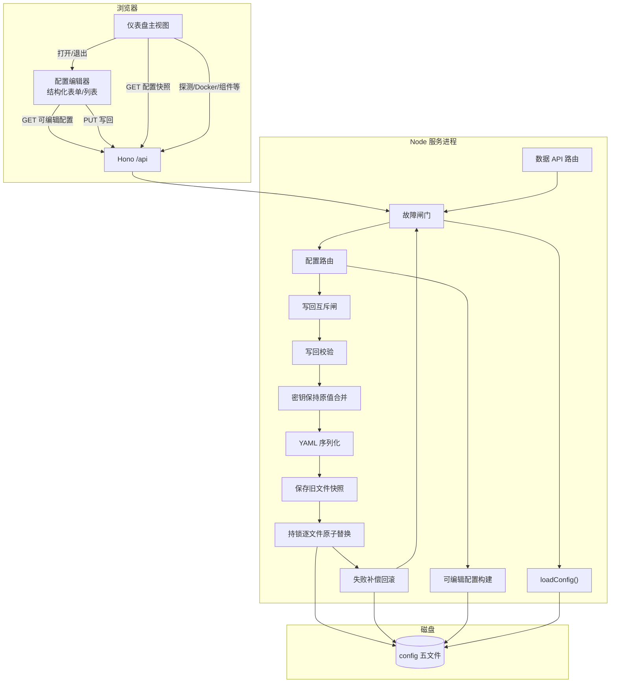
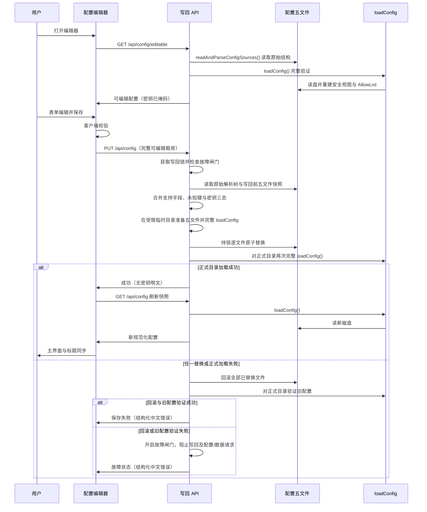
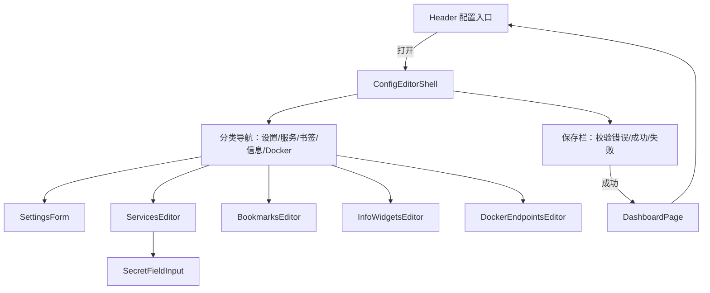

# 设计文档：实时配置编辑

## 概述

本特性在**尽量少改架构**的前提下，为 Homepage 仪表盘增加「结构化友好配置编辑 + 实时写回生效」能力。配置目录下的五份 YAML（`settings.yaml`、`services.yaml`、`bookmarks.yaml`、`widgets.yaml`、`docker.yaml`）仍是**唯一持久化真相**；服务端继续通过既有 `loadConfig()` 完成读盘、解析、规范化、`${ENV_VAR}` 整值插值、安全视图校验与当次 AllowList 重建。前端不出现 YAML 源码编辑器，用户通过与仪表盘同一技术栈（React + Vite + Tailwind + CSS 主题令牌 + 既有 shadcn/ui）实现的表单/列表界面完成结构化编辑；服务、书签和信息组件支持增删改与调序，Docker 端点只需增删改。保存时服务端以「准备新文件、保存旧文件快照、持锁替换、失败补偿回滚、正式目录完整加载验证、故障闸门」保证五文件整体语义；后续数据 API 无需重启即可按每请求重新加载的磁盘配置鉴权与返回。

**设计原则：**

1. **简单重构**：在现有 monorepo 边界内增量扩展（`packages/config` 读写与可编辑模型、`packages/server` 路由、`apps/web` 编辑器 UI），不引入数据库、配置版本库、WebSocket/SSE、多用户认证或第二套 UI 体系。
2. **单一加载语义**：写回成功后的读与鉴权必须走与现有 `loadConfig()` 相同的完整管线；禁止进程内跨请求缓存 AllowList / 规范化配置作为真相。
3. **密钥不出浏览器**：可编辑配置、配置快照与写回响应仅含掩码/已配置状态或未配置；写回时「保持原值」由服务端从磁盘合并，客户端不回传明文。
4. **结构化编辑面**：YAML 仅作服务端持久化格式；浏览器载荷始终是对象/列表/字段，可直接绑定表单控件。
5. **与手改 YAML 共存**：落盘结果为 UTF-8 纯文本 YAML，可被常规编辑器与现有加载器读取；保存以原始解析树为基底，仅合并编辑器支持字段，未知/未支持键原样保留；无改动往返保存须保持语义、顺序与稳定 ID。
6. **失败不发布混合真相**：Node 与常规文件系统不提供跨五文件的原子 `rename`；因此使用进程内互斥、写回前快照、逐文件原子替换、补偿回滚和故障闸门实现五文件整体成功或恢复旧状态的需求语义，不引入数据库。

---

## 架构

### 总体架构

沿用现有 **BFF 单进程**：浏览器只与本机 `/api/*` 通信。本特性在配置路径上增加「可编辑视图构建」与「校验后原子写回」两条支路，数据 API 路径保持「每次 `loadConfig()`」。



### 请求时序



### 关键设计决策

| 决策 | 选择 | 理由 |
| --- | --- | --- |
| 持久化介质 | 仅配置五文件 | 满足「无数据库、真相在 YAML」；与手改共存 |
| 读生效路径 | 每次数据 API / 配置读取均 `loadConfig()` | 现有行为已满足「立即生效、无跨请求缓存」；写回只需落盘 |
| 可编辑模型 | 独立 `EditableConfig`，与 `NormalizedConfig` 区分 | 快照不含 Docker 端点声明、探测 URL、组件密钥状态等编辑所需字段；二者职责分离 |
| 可编辑构建来源 | 同一请求同时使用 `readAndParseConfigSources()` 原始解析树与完整 `loadConfig()` | 原始树用于编辑字段、密钥状态和未知键保留；`loadConfig()` 用于解析、规范化、安全视图与 AllowList 合法性验证；不得从安全视图反推密钥 |
| 未支持键兼容 | 以原始解析树为基底，仅合并编辑器支持字段 | 未知/未支持键原样保留；若原始结构与支持字段无法无歧义、安全地合并，保存前拒绝并返回中文字段路径，禁止静默删除 |
| 写回前校验 | 结构 schema + 合并密钥和未知键后的受限临时目录完整 `loadConfig()` | 保证候选五文件能通过现有完整加载管线；临时目录和文件仅当前用户可访问并始终清理 |
| 写回成功条件 | 五文件替换完成后，对正式目录再次完整 `loadConfig()` 成功 | 只有正式磁盘配置完成解析、规范化、安全视图和 AllowList 验证后才响应成功 |
| 保存失败恢复 | 写回前五文件快照 + 已替换文件补偿回滚 + 正式目录旧配置验证 | 常规文件系统无跨五文件原子替换；用补偿事务尽最大可实现程度恢复写回前五文件，不能接受新旧混合等待下次保存修复 |
| 故障闸门 | 回滚失败或回滚后旧配置验证失败时进入进程内明确故障状态 | 阻止后续配置写回；配置读取和数据请求返回结构化错误，直至运维恢复磁盘配置并由完整 `loadConfig()` 验证成功；混合磁盘不得作为鉴权真相 |
| 密钥写回 | `keep` / `set` / `clear` 三态；keep 时服务端读盘合并 | 客户端永不持有明文；空串显式清空；Docker 连接串只允许无 userinfo 的受支持形式 |
| 并发 | 进程内写回互斥队列（串行化）；前端保存中禁用按钮 | 锁覆盖快照、准备、替换、正式验证及必要回滚，防止五文件交叉混写 |
| 前端入口 | 页眉增加「配置」按钮；全屏/大对话框承载编辑器 | 复用 `Dialog`/`Button` 等既有原语；退出即回主视图 |
| 调序 | 服务分组/项、书签分组/项和信息组件使用上移/下移按钮；Docker 端点不提供调序 | 不引入拖拽库；满足要求且避免扩大 Docker 编辑范围 |
| UI 控件扩展 | 优先 `components/ui`；缺 Switch/Label/Textarea 时按 shadcn 同风格补齐 | 不引入第二组件库 |
| 写回 HTTP | `GET /api/config/editable` + `PUT /api/config` | 与现有 `GET /api/config` 并列；语义清晰 |

### 逻辑边界与改动面

| 层 | 包/目录 | 本特性职责 |
| --- | --- | --- |
| 配置层 | `packages/config` | 可编辑模型构建、完整加载核对、原始树保留合并、密钥掩码与 Docker 凭据拒绝、候选文件准备与校验、快照、替换、补偿回滚、正式目录验证（互斥和故障闸门可由 server 持有） |
| 领域契约 | `packages/domain` | `EditableConfig` 及相关 zod schema、API 路由常量、成功/错误响应类型扩展 |
| API | `packages/server` | 注册可编辑读取与写回路由；写回互斥；响应密钥扫描；超时与错误映射 |
| 前端 | `apps/web` | 配置编辑器页面/对话框、分区表单、客户端校验、保存状态机、保存成功后刷新仪表盘快照与 `document.title` |

**最小核查与修正：** 逐一核查配置读取、HTTP 探测、Docker、信息组件、服务组件路由；若任一路径存在跨请求缓存或绕过，最小修正为每个请求均调用完整 `loadConfig()`，并在故障闸门开启时返回结构化错误。保持 AllowList 结构、代理门禁、主题系统与搜索浮层业务逻辑不变。

---

## 组件与接口

### 后端模块

#### 1. 可编辑配置构建（`packages/config`）

| 符号（概念） | 职责 |
| --- | --- |
| `buildEditableConfig(sources, loadedConfig, options?)` | 将 `ParsedConfigSources` 投影为 `EditableConfig`，并以同一磁盘内容的完整加载结果确认受支持字段语义；密钥与 customapi `headers` 值仅输出状态，不插值、不回传存储全文 |
| `getEditableConfig(loadOptions)` | 同一请求先 `readAndParseConfigSources()` 获取原始解析树，再调用完整 `loadConfig()` 完成解析、规范化、安全视图和 AllowList 合法性验证，二者均成功后才构建可编辑结果；不得从安全视图反推密钥 |

构建规则要点：

- **受支持字段子集**与现有规范化器对齐：设置（title、background、useEqualHeights、layout.\*.columns）、服务分组/项、书签分组/项、信息组件、Docker 端点。
- 原始 YAML 中存在但第一阶段不编辑的键（如 `language`、`headerStyle`、`showStats`、`ping`、未知 widget 类型等）不进入可编辑模型主字段，但必须保留在服务端原始解析树中。保存时以该原始树为基底，只替换编辑器明确支持的字段和列表位置；未支持键及其值原样保留。
- 合并必须按文件和字段路径显式执行，不以可编辑模型整文件覆盖原始树。若同一路径存在别名、类型冲突、重复语义来源，或列表条目无法凭既有身份字段安全对应，系统必须在修改正式目录前拒绝保存，并返回简体中文字段路径及原因；禁止猜测映射、静默删除或把未知键移动到其他条目。
- `GET /api/config/editable` 的成功还要求完整 `loadConfig()` 成功；原始树负责保留信息和判定存储侧密钥状态，安全视图只用于一致性核对，不得用于反推任何密钥。
- 服务 YAML 形状保持上游兼容的「分组对象数组」语义投影为明确列表：`groups: [{ name, items: [...] }]`，避免前端理解 `- Server: [ ... ]` 这种 YAML 特有结构。
- Docker：`Record<name, connectionString>` → `endpoints: [{ name, connection }]`；第一阶段只提供增删改，不提供调序，序列化时保留未修改端点的原有相对顺序，新端点按编辑器列表追加。
- Docker 连接串按敏感输入处理：仅允许加载器支持且不含 URI `userinfo` 的连接串。若检测到 `user:password@`、`user@` 等内嵌凭据，`GET /api/config/editable` 与保存均返回不含原串的简体中文结构化错误，要求改用环境变量或安全的服务端配置方式；前端不得收到该连接串、其中用户名或凭据。
- 密钥字段（`password` / `key` / `apiKey` / `token` / `username`）与 customapi `headers[*]`：
  - 磁盘非空字符串 → `{ status: "configured" }`（或等价「已配置」）；
  - 缺失/空 → `{ status: "unset" }`；
  - **禁止**返回占位全文、字面量全文或插值后明文。

#### 2. 写回管线（`packages/config` + `packages/server`）

| 符号（概念） | 职责 |
| --- | --- |
| `parseEditableConfigWrite(body)` | zod 校验写回载荷；剔除/忽略 `allowList`、已解析密钥表等旁路字段 |
| `mergeEditableIntoSources(writePayload, diskSources)` | 以原始解析树为基底，仅更新受支持字段；密钥 `keep` 使用写回前磁盘字符串，`set` 使用新值，`clear`/空串按空值语义；未知键原样保留；无法安全对应时以中文字段路径拒绝 |
| `editableToFiveYamlDocuments(mergedSources)` | 从完成保留合并的五棵解析树生成 UTF-8 YAML 文本；保持条目顺序和身份字段语义，不添加影响稳定 ID 的隐式字段 |
| `prepareAndValidateFiveFiles(yamlTexts, env)` | 在仅当前用户可访问的独立临时目录中准备五份新文件，权限收紧为当前用户；调用完整 `loadConfig()`；无论成功失败都在 `finally` 清理全部临时目录和文件 |
| `snapshotFiveFiles(configDir)` | 持锁读取写回前五文件的存在状态与完整字节内容，形成仅本次请求可访问的回滚快照；快照不得进入公开错误、响应或日志 |
| `replaceFiveFiles(configDir, preparedFiles)` | 锁内逐文件执行同目录临时文件到目标文件的原子 `rename`；记录已替换文件，供失败补偿 |
| `rollbackReplacedFiles(configDir, snapshot, replaced)` | 任一替换失败或正式目录验证失败时，对全部已替换目标用旧快照逐一原子恢复；原先不存在的文件恢复为不存在；随后对正式目录完整 `loadConfig()` 验证旧配置 |
| `configFaultGate` | 回滚失败或旧配置验证失败时进入明确故障状态；阻止后续配置写回，配置读取与各数据 API 返回结构化错误；仅在磁盘被恢复且完整 `loadConfig()` 验证成功后解除 |
| `withConfigWriteLock(fn)` | 进程内互斥覆盖原始树读取、快照、准备、替换、正式验证、回滚与故障状态更新；重叠写回串行处理 |

**写回成功条件（全部满足）：** 请求体通过 schema；未知键与密钥安全合并成功；受限临时目录中的候选五文件通过完整 `loadConfig()`；五文件全部替换成功；替换后对正式配置目录再次执行完整 `loadConfig()` 成功。只有满足全部条件才返回 `{ ok: true }`。

**保存失败语义：** 任一替换或正式目录 `loadConfig()` 失败，均必须在仍持有写回锁时回滚全部已替换文件，并在回滚后对正式目录执行完整 `loadConfig()` 验证写回前配置。不能把新旧混合、等待下次保存修复视为可接受状态。若回滚或旧配置验证失败，则开启故障闸门；此时混合磁盘配置不得作为配置结果或鉴权真相。

**文件系统边界：** Node 和常规文件系统只能保证单个目标文件的原子 `rename`，没有跨五文件原子 `rename`。本设计不引入数据库，而以互斥、旧快照、单文件原子替换、补偿回滚、正式目录验证和故障闸门实现五文件整体保存语义。所有准备文件、同目录替换临时文件与快照文件（若快照落临时盘）必须仅当前用户可访问，并在 `finally` 中清理；其路径和内容不得写入公开错误或日志。

#### 3. HTTP 接口（`packages/server`）

扩展 `packages/domain` 的 `ApiRoutes`：

| 方法 | 路径 | 说明 |
| --- | --- | --- |
| `GET` | `/api/config` | **保持不变**：规范化配置快照 |
| `GET` | `/api/config/editable` | 返回 `EditableConfig`（浏览器安全） |
| `PUT` | `/api/config` | 接收完整可编辑写回载荷；成功返回 `{ ok: true }`（可附带与快照语义等价的非密钥摘要，**非必须**；前端可再拉 `/api/config`） |

错误：沿用 `ErrorEnvelope`（`ok: false` + `PublicError`），`message` 为简体中文；可含经过白名单化和脱敏的 `file` / `path` / `line` / `column` / `code`。新增接口及统一错误映射不得携带原始请求体、密钥、敏感异常原文、临时路径或临时内容；写回锁等待或故障闸门状态使用固定中文消息和稳定错误码。

所有公开出口统一执行安全断言：入口 HTML、API 响应正文与响应头均不得包含完整密钥、存储侧敏感值、Docker userinfo、临时路径或可还原它们的信息。可编辑 GET 在构建阶段只产生密钥状态，并对响应做 schema 断言；写回响应禁止回显 `set` 的新值或请求片段。不得为了扫描而把明文加入响应对象。

异常处理只记录稳定错误码、配置文件逻辑名和脱敏字段路径；不得记录原始请求、敏感异常原文、Docker 敏感连接串、快照/临时文件路径或内容。Hono `onError` 与写回路径 `try/catch` 必须将异常转为结构化中文错误，确保进程不退出。

#### 4. 前端模块（`apps/web`）



| 组件 | 职责 |
| --- | --- |
| `Header` 扩展 | 增加「配置」按钮（中文）；与主题、搜索并列 |
| `ConfigEditorShell` | 打开时 `GET editable`；加载/错误/空状态；退出；托管草稿 state；保存状态机 |
| `SettingsForm` | 标题、背景、等高、layout 分组列数 |
| `ServicesEditor` | 分组与服务项列表；新增/删除/上移/下移；字段表单；探测与 Docker 引用；组件类型与选项 |
| `BookmarksEditor` | 书签分组与项，同上 |
| `InfoWidgetsEditor` | datetime / openmeteo / resources 选项表单 |
| `DockerEndpointsEditor` | 端点名 + 连接串列表，仅支持新增、删除、修改；不提供调序；连接串作为敏感输入，不回显含凭据原串 |
| `SecretFieldInput` | 默认掩码或空；「已配置」提示；用户输入新值才进入 set；未改动 keep；支持显式清空 |
| API client 扩展 | `fetchEditableConfig`、`saveConfig`；30s 超时；保存中 abort 处理 |

**客户端校验（保存前，失败不发请求）：**

- 名称类字段 trim 后非空（服务/书签/分组/端点名等必填项）
- `href` / 探测 URL / 组件 url 等链接：绝对 `http:`/`https:`（复用 domain 的 `normalizeAbsoluteHttpUrl` 语义）
- Docker 连接串非空、属于加载器支持的形式且不含 URI `userinfo`；检测到内嵌凭据时使用固定中文提示，要求改用环境变量或安全服务端配置方式，不得在提示、表单回显或日志中包含原串；信息组件类型与必填选项（如 openmeteo 坐标）
- 简体中文字段级错误文案

**保存状态机：** `idle → validating → saving → success | error`；`saving` 期间禁用保存入口并忽略重复激活；结束后恢复并展示中文反馈；失败保留全部草稿，不自动关闭编辑器。

**保存成功后同步：**

1. `fetchConfig()`（或使用约定的等价快照）更新 `DashboardPage` 配置 state；
2. 按需求更新 `document.title`（非空 trim 标题，否则既有中文默认标题）；
3. 不必整页刷新；各卡片仍按现有逻辑用新 id 拉数据 API（服务端已按新 AllowList 工作）。

### 目录规划（增量）

```text
packages/domain/src/contracts/
  editable-config.ts          # Editable* schema 与类型
  api.ts                      # 扩展 ApiRoutes / success schemas

packages/config/src/
  editable/
    build-editable.ts
    merge-sources.ts
    serialize.ts
    validate-write.ts
    prepare-files.ts
    snapshot-rollback.ts
    write-lock.ts             # 或放 server
    fault-gate.ts             # 或放 server
  index.ts                    # 导出新 API

packages/server/src/routes/
  config.ts                   # 增加 GET editable、PUT 写回

apps/web/src/
  components/config-editor/   # 编辑器业务组件
  components/ui/              # 按需补 Label/Switch/Textarea 等
  lib/api/client.ts           # fetchEditableConfig / saveConfig
  pages/DashboardPage.tsx     # 入口与保存后刷新
  components/layout/Header.tsx
```

---

## 数据模型

### 与现有模型关系

| 模型 | 用途 | 含密钥明文？ | 含 Docker 端点声明？ |
| --- | --- | --- | --- |
| 磁盘五文件 YAML | 唯一持久化真相 | 可含占位或字面量（仅磁盘/服务端） | 是（docker.yaml） |
| `NormalizedConfig` | 仪表盘展示快照 | 否 | 否 |
| `AllowList` | 当次鉴权 | 是（仅服务端内存） | 是（解析后） |
| `EditableConfig` | 表单绑定与写回 | 否（仅 status / 写回三态） | 是（可编辑列表） |

### 密钥字段表示

```typescript
/** 下发给浏览器的密钥字段视图 */
type SecretFieldView = {
  status: "configured" | "unset";
};

/** 写回时客户端提交的密钥字段 */
type SecretFieldWrite =
  | { mode: "keep" }
  | { mode: "set"; value: string } // 非 keep；value 可为字面量或 `${ENV}` 整值占位
  | { mode: "clear" }; // 与 set+空串等价，实现可只保留一种
```

规则：

- GET：磁盘非空 → `configured`；否则 `unset`。
- PUT：`keep` → 服务端写入写回前磁盘原串（可为 `${QBIT_PASSWORD}` 或字面量）；不得写掩码文案。
- PUT：`set` + 非空 → 原样存储；若整值匹配 `WHOLE_ENV_PLACEHOLDER_RE` 则按占位存，仅服务端插值。
- PUT：`clear` 或 `set`+`""` → 按空值持久化（写空串或省略键，与加载器空密钥语义一致），**不**保留旧值。
- customapi `headers`：每个 header 值同样使用 View/Write 三态；不得下发明文 header 值。

### EditableConfig（概念 schema）

以下为第一阶段逻辑形状（实现用 zod 落在 `packages/domain`）：

```typescript
type EditableSettings = {
  title: string;
  background?: string;
  useEqualHeights: boolean;
  layout: Array<{ groupName: string; maxColumns: number }>; // 或 Record；列表便于表单
};

type EditableHttpProbe = {
  enabled: boolean;
  /** siteMonitor 显式 URL；enabled 且空时可约定回退 href（与加载器 resolveProbeTargetUrl 对齐） */
  url?: string;
  expectedStatus?: string; // 与现有配置接受的表达一致，或结构化 ranges
  timeoutSec?: number; // 1–60，与 normalizeProbeTimeoutMs 对齐
};

type EditableServiceWidget = {
  type: "qbittorrent" | "emby" | "customapi" | string; // 未知类型可只读展示或限制选择
  url?: string;
  username?: SecretFieldView; // GET；PUT 时为 SecretFieldWrite
  password?: SecretFieldView;
  key?: SecretFieldView;
  apiKey?: SecretFieldView;
  token?: SecretFieldView;
  method?: "GET";
  headers?: Array<{ name: string; value: SecretFieldView }>;
  mappings?: Array<{ field?: string; label?: string; format?: string; path?: string; id?: string }>;
  // emby 等非密钥展示选项按需列入受支持子集
};

type EditableServiceItem = {
  name: string;
  href?: string;
  target?: "_blank" | "_self" | "_parent" | "_top";
  icon?: string;
  description?: string;
  httpProbe?: EditableHttpProbe;
  docker?: { server: string; container: string };
  widget?: EditableServiceWidget;
};

type EditableServiceGroup = {
  name: string;
  items: EditableServiceItem[];
};

type EditableBookmarkItem = {
  name: string;
  href: string;
  target?: "_blank" | "_self" | "_parent" | "_top";
  icon?: string;
  abbr?: string;
  description?: string;
};

type EditableBookmarkGroup = {
  name: string;
  items: EditableBookmarkItem[];
};

type EditableInfoWidget =
  | {
      type: "datetime";
      timezone?: string;
      label?: string;
      format?: { timeStyle?: string; dateStyle?: string; hour12?: boolean };
    }
  | {
      type: "openmeteo";
      latitude: number;
      longitude: number;
      timezone?: string;
      label?: string;
    }
  | {
      type: "resources";
      cpu?: boolean;
      memory?: boolean;
      disk?: string | string[];
      label?: string;
    };

type EditableDockerEndpoint = {
  name: string;
  connection: string; // 仅允许加载器支持且不含 URI userinfo 的形式
};

type EditableConfig = {
  settings: EditableSettings;
  services: EditableServiceGroup[];
  bookmarks: EditableBookmarkGroup[];
  infoWidgets: EditableInfoWidget[];
  dockerEndpoints: EditableDockerEndpoint[];
};
```

写回请求体：与上相同结构，但所有 `SecretFieldView` 替换为 `SecretFieldWrite`。可增加可选 `clientMeta`（忽略）。**忽略**任何 `allowList` / `secrets` / `resolved*` 旁路字段。

### YAML 序列化形状（服务端）

必须能被现有加载器识别：

| 文件 | 序列化目标形状（逻辑） |
| --- | --- |
| `settings.yaml` | 映射：`title`、`background`（字符串或 `{ image }` 与现网一致选一种，推荐与当前示例兼容的 `background.image` 或字符串——**实现时与 `normalizeBackground` 双形态兼容，写出选一种稳定形态**）、`useEqualHeights`、`layout: { [group]: { columns } }` |
| `services.yaml` | 数组：`[{ [groupName]: [ item, ... ] }, ...]`；item 含 name/href/target/icon/description/siteMonitor/server/container/widget… |
| `bookmarks.yaml` | 同服务分组数组形状 |
| `widgets.yaml` | 信息组件对象数组 |
| `docker.yaml` | 以原始映射为基底更新 `{ [endpointName]: connectionString }`；不要求端点调序，未修改端点保持相对顺序 |

编码：UTF-8；`yaml` 包 stringify；无二进制封装。序列化对象来自原始解析树的保留合并结果，不得用受支持子集整文件重建；任何无法安全合并的结构必须在保存前拒绝并给出中文字段路径。

### 稳定 ID 与往返

无改动保存（字段与顺序不变、密钥全 `keep`）后：

- `serviceId` / `probeId` / `widgetId` / `infoId` 与保存前一致（身份字段未变）；
- 磁盘密钥存储值与保存前逐字节（字符串）一致；
- 主视图集合与顺序一致。

实现上依靠：以原始解析树做保留合并；序列化保持服务、书签、信息组件的分组与项数组顺序；Docker 端点不提供调序且保留未修改端点相对顺序；密钥 keep 原样；不得引入默认 ID、编辑器元数据、占位键、排序键或其他会参与身份规范串的隐式字段。只有用户显式修改身份字段时，稳定 ID 才可按既有计算规则变化。

### 并发模型

```text
writeLock: Promise 链或 mutex
PUT 进入 → await lock → 全流程 → release
```

- 串行化：后请求等待前请求结束再处理（仍是完整五文件替换，非字段合并）。
- 前端：飞行中禁用保存，避免无谓并行。
- 不提供多人字段级 merge。

---

## 正确性属性

*属性是系统在所有有效执行中均应保持为真的特征或行为，用于约束实现语义；本节不要求新增自动化测试。*

### 属性 1：全 keep 往返保留语义、未知键与密钥

*对于任意* 能被现有 `loadConfig()` 成功加载的配置五文件内容，构建可编辑配置后在全部密钥字段以 `keep`、其余支持字段不改动的前提下写回成功，则：再次 `loadConfig()` 必须成功；受支持字段子集语义与写回前一致；全部未知/未支持键及其所属结构原样保留；磁盘上各密钥字段存储值与写回前完全相同；对应条目的 `serviceId`、`probeId`、`widgetId`、`infoId` 与写回前相同。若该原始结构无法安全保留合并，则必须在正式目录零修改时拒绝保存。

**验证需求：** 2.5、4.5、6.3、9.2、9.3、9.4

### 属性 2：成功写回后加载与载荷一致

*对于任意* 通过服务端校验的可编辑写回载荷，在写回接口返回成功之后，下一次针对同一配置目录的 `loadConfig()`（及等价读盘规范化）得到的受支持字段子集，必须与该次载荷在合并密钥规则之后的语义一致（在环境变量与 keep 所保留的占位不变的前提下）。

**验证需求：** 1.3、4.3、5.1、6.3

### 属性 3：公开响应不含完整密钥明文

*对于任意* 在磁盘、环境变量或写回 `set` 中出现的非空密钥字符串，入口 HTML、所有 API 响应正文与响应头、可编辑读取与写回错误中，均不得包含该完整明文、完整存储值、原始请求片段或敏感异常原文，也不得包含可用于还原它们的信息；可编辑侧密钥字段仅能为已配置/未配置状态表示。

**验证需求：** 1.5、2.3、4.6、7.1、7.2、7.3、8.2

### 属性 4：可编辑密钥视图状态

*对于任意* 服务组件或 header 上的密钥字段，若写回前磁盘存储值为非空字符串，则可达浏览器的可编辑表示必须为「已配置」类状态且不含存储全文；若缺失或为空，则必须为「未配置」或空可编辑状态。

**验证需求：** 2.3、7.1

### 属性 5：非法写回不修改磁盘

*对于任意* 未通过服务端校验的写回载荷，写回接口必须失败返回，且配置目录下五文件内容必须与调用前逐字节相同。

**验证需求：** 4.2、4.7、5.5

### 属性 6：keep 保留磁盘原串

*对于任意* 密钥字段在磁盘上的非空存储字符串（含 `${ENV_VAR}` 整值占位与字面量），当写回对该字段标记 `keep` 且写回成功时，该字段在磁盘上的存储值必须与写回前完全相同。

**验证需求：** 4.5、9.4

### 属性 7：set 写入新值且响应不回显

*对于任意* 非空新密钥字符串，当写回对该字段 `set` 为该值且成功时，磁盘存储值必须等于该新值（整值占位则原样存占位串）；该次写回响应中不得出现该新值全文。

**验证需求：** 4.6、7.3

### 属性 8：clear/空串清空密钥

*对于任意* 写回前磁盘上存在非空存储值的密钥字段，当写回以 `clear` 或 `set` 空字符串提交且成功时，持久化结果必须按空值语义处理（空串或省略键），不得继续保留写回前旧密钥存储值；随后可编辑视图必须表现为未配置。

**验证需求：** 4.10

### 属性 9：列表顺序在序列化往返中保持

*对于任意* 可编辑配置中的服务分组、组内服务项、书签分组、组内书签项与信息组件列表，经服务端序列化为五文件再解析为可编辑/规范化列表后，相对顺序必须与写回载荷中的顺序一致。Docker 端点无需提供调序；未修改端点的原有相对顺序必须保持，新端点按编辑器列表追加。

**验证需求：** 3.4

### 属性 10：并发写回无交叉混写

*对于任意* 两个均能单独校验通过的写回载荷 A 与 B，当其处理在时间上重叠时，锁必须使两次保存事务互不交错；事务结束后的可服务状态中，配置五文件整体只能是写回前快照、A 成功结果或 B 成功结果之一，不得出现 A/B 交叉混写。逐文件替换期间单文件不得截断或半写入；若事务无法恢复到整体一致且可完整加载的状态，故障闸门必须阻止该中间状态被配置或数据请求使用。

**验证需求：** 6.1、6.4

### 属性 11：单次成功写回的五文件同源且正式加载有效

*对于任意* 一次返回成功的写回，写回后五份配置文件内容必须均由该次同一已校验载荷与写回前原始解析树保留合并生成，不得在仅部分类别文件更新时返回成功；且正式配置目录必须已再次通过完整 `loadConfig()`。

**验证需求：** 4.9、4.11、5.1

### 属性 12：旁路字段忽略

*对于任意* 在写回 JSON 中附加的 `allowList`、已解析密钥表或其它试图绕过加载器规范化的旁路字段，写回处理必须忽略这些字段；写回成功后的 AllowList 必须仅由持久化五文件经 `loadConfig()` 重建，且这些旁路内容不得出现在五文件中。

**验证需求：** 7.4

### 属性 13：默认写回载荷中密钥均为 keep

*对于任意* 由可编辑配置视图在用户未修改任何密钥字段的前提下生成的保存载荷，其中全部密钥字段（含 customapi header 值）的 mode 必须为 `keep`。

**验证需求：** 3.5、2.5

### 属性 14：客户端拒绝无效名称与链接

*对于任意* 去除首尾空白后为空的名称字段，或不是绝对 HTTP/HTTPS URL 却作为链接提交的字段，客户端校验必须失败，且不得生成可发送的写回请求判定为通过。

**验证需求：** 3.6

### 属性 15：文档标题解析

*对于任意* 字符串 title，若去除首尾空白后非空，则仪表盘文档标题必须为该去空白结果；否则必须为既有非空中文默认标题。

**验证需求：** 5.4

### 属性 16：落盘为可解析的 UTF-8 YAML 文本

*对于任意* 成功写回，每个被写入的配置五文件必须是 UTF-8 纯文本，且能被现有配置加载器的 YAML 解析路径成功解析（在内容本身合法的前提下）。

**验证需求：** 4.3、9.5

### 属性 17：可编辑构建与完整加载一致

*对于任意* 磁盘内容，`GET /api/config/editable` 只有在 `readAndParseConfigSources()` 与同一配置目录的完整 `loadConfig()` 均成功时才可返回成功；可编辑投影在受支持字段子集上必须与规范化语义一致，密钥状态只能来自原始解析树且不得从安全视图反推。单文件缺失及全缺失按既有加载器空值/默认语义处理。

**验证需求：** 1.2、2.1、2.3、2.6

### 属性 18：未支持键保留或安全拒绝

*对于任意* 含未知或第一阶段未支持键的合法原始解析树，保存只能修改编辑器支持字段，其他键及其所属条目必须原样保留；若无法无歧义地完成保留合并，保存必须在正式目录零修改时失败，并返回不含敏感内容的简体中文字段路径，禁止静默删除。

**验证需求：** 2.5、4.2、9.1、9.2

### 属性 19：替换失败回滚与故障闸门

*对于任意* 五文件替换或替换后正式目录完整加载失败，系统必须在锁内按写回前快照回滚全部已替换文件，并在正式目录验证旧配置；若回滚或旧配置验证失败，必须开启故障闸门，后续配置写回、配置读取及数据 API 均返回结构化错误，且不得使用混合磁盘配置进行鉴权，直至恢复并通过完整 `loadConfig()`。

**验证需求：** 4.4、4.8、4.9、5.5、6.1、8.1

### 属性 20：Docker 内嵌凭据拒绝且不下发

*对于任意* 含 URI `userinfo` 的 Docker 连接串，`GET /api/config/editable` 与保存均必须失败并返回固定简体中文指引，且公开正文、响应头、入口 HTML 与日志中不得出现原连接串、用户名或凭据；无 `userinfo` 的受支持连接串才可进入前端编辑模型。

**验证需求：** 1.5、2.4、7.1、8.2

### 属性 21：临时资源隔离与清理

*对于任意* 写回成功或失败路径，准备目录、临时文件与落盘快照文件必须仅当前用户可访问，并在 `finally` 中清理；公开错误与日志不得包含其路径或内容。

**验证需求：** 1.5、4.8、8.2、8.4

### 属性 22：数据 API 每请求完整加载

*对于任意* 配置读取、HTTP 探测、Docker、信息组件和服务组件请求，在故障闸门关闭时必须为该请求执行完整 `loadConfig()` 并使用当次结果，不得使用跨请求缓存或旁路真相；故障闸门开启时必须直接返回结构化错误。

**验证需求：** 1.2、1.3、1.6、5.1、5.2、7.5

---

## 错误处理

### 错误分类与响应

| 场景 | HTTP/结果 | 用户可见 | 磁盘 | 前端行为 |
| --- | --- | --- | --- | --- |
| 可编辑读取：YAML 语法/顶层结构/加载器失败 | 4xx + `CONFIG_INVALID` 等 | 简体中文，含文件名；可定位时含 path/行列 | 不改 | 编辑器内错误+下一步提示；不白屏；可退出 |
| 客户端校验失败 | 不发起请求 | 字段级中文提示 | 不改 | 保留草稿 |
| 服务端校验失败 | 4xx | 中文原因；可定位时含 path/类别/文件名 | 不改 | 展示错误、保留全部编辑 |
| 目录不可写/临时文件/rename/正式目录验证失败，且回滚成功 | 5xx 或 4xx 明确失败 | 固定中文表明保存未成功，不含路径与敏感原文 | 恢复写回前五文件并完成旧配置验证 | 保留草稿，可重试 |
| 回滚失败或回滚后旧配置验证失败 | 5xx + `CONFIG_FAULTED` | 固定中文故障提示和恢复指引，不含磁盘内容、临时路径或敏感异常原文 | 状态不可信，不作为鉴权真相 | 开启故障闸门；配置写回、配置读取和数据 API 均返回结构化错误，直至恢复验证成功 |
| Docker 连接串含 userinfo | 4xx + `DOCKER_CONNECTION_SENSITIVE` | 中文要求改为环境变量或安全服务端配置，不回显原串 | 读取不改；保存前零修改 | 不下发连接串，保留安全草稿字段 |
| 写回锁等待/拒绝 | 409 或 429 | 中文「保存进行中」类 | 不改 | 可稍后重试 |
| 网络失败或 30s 超时 | 客户端判定失败 | 中文失败提示 | 以服务端实际为准（未知则当失败） | 保留草稿，允许再保存 |
| 写回路径未捕获异常 | 结构化错误，进程不退出 | 中文通用错误，仅稳定错误码，无密钥或敏感异常原文 | 若已替换则进入回滚流程 | 不显示成功 |
| 普通数据请求 `loadConfig()` 失败 | 该次数据 API 失败 | 可观察结构化错误，不伪造成功数据 | 保持当前磁盘 | 不回退进程内旧 AllowList；若处于保存回滚故障则由故障闸门统一阻止 |

### 密钥、公开输出与日志

- 所有对外 `PublicError`、UI 文案、入口 HTML、API 响应正文与响应头均不得包含原始请求、完整密钥、存储侧敏感值、Docker userinfo、敏感异常原文、临时路径或临时内容。
- 服务端日志只允许稳定错误码、配置文件逻辑名和脱敏字段路径；禁止记录原始请求体、密钥字段值、含凭据连接串、未经筛选的异常消息、快照和临时资源路径或内容。
- `GET /api/config/editable` 与写回均在发现 Docker 内嵌凭据时使用固定中文错误，要求改用环境变量或安全服务端配置方式，不得下发或回显原串。
- 写回响应禁止回显 `set` 的新值；错误映射不得引用包含该值的校验器或文件系统异常原文。

### 五文件一致性与失败恢复

1. **持锁读取与快照**：互斥锁覆盖整个事务。修改正式目录前，读取同一时点原始解析树，并保存五文件的存在状态和完整旧内容；快照仅本次事务可访问。
2. **准备与预验证**：在仅当前用户可访问的临时目录中准备齐五份候选文件，并调用完整 `loadConfig()`。任何结构、合并、序列化或预验证失败均保持正式目录零修改。
3. **逐文件替换**：对每个正式文件使用同目录临时文件、必要的持久化步骤和单目标原子 `rename`，记录已替换集合。Node 与常规文件系统没有跨五文件原子 `rename`，因此不能宣称五次替换天然构成文件系统事务。
4. **正式目录验证**：全部替换后，在仍持锁时对正式目录再次执行完整 `loadConfig()`。只有该验证成功才可返回保存成功。
5. **补偿回滚**：任一替换失败或正式目录验证失败时，立即按旧快照对全部已替换目标执行补偿回滚；原先不存在的目标恢复为不存在。回滚完成后必须对正式目录执行完整 `loadConfig()` 验证写回前配置。保存失败必须尽最大可实现程度恢复写回前五文件，不接受新旧混合作为可继续服务或等待下次保存修复的状态。
6. **故障闸门**：任一回滚操作失败或回滚后旧配置验证失败，进入 `CONFIG_FAULTED`。此状态阻止后续配置写回；配置读取、HTTP 探测、Docker、信息组件和服务组件请求均返回结构化中文错误，不读取混合磁盘建立安全视图或 AllowList。运维恢复五文件后，只有完整 `loadConfig()` 验证成功才解除闸门。
7. **临时资源清理**：准备目录、同目录临时文件和落盘快照文件（如有）使用仅当前用户可访问的权限，并由事务最外层 `finally` 清理；清理失败只能记录脱敏稳定错误码，不得泄露路径或内容。
8. **并发**：后续写回在前一事务完成正式验证、回滚或故障状态落定前不得进入；故障闸门开启时不允许新写回来“覆盖修复”。

### 前端可用性

- 保存失败关闭提示后：留在编辑器，草稿不丢，未改密钥仍 keep。
- 读取 editable 失败：中文错误，可退出；退出后主视图仍用写回前已成功加载的快照（若有）。
- 保存中：禁用保存，忽略重复激活。

---

## 验证说明

本规格不新增或要求实施自动化测试，不指定测试工具、属性测试框架或测试实施顺序。实现阶段仅执行现有项目的 TypeScript 类型检查与构建，确认相关包可编译且未引入新的构建错误；「正确性属性」保留为实现必须满足的规格约束，而非测试任务。

### 风险与缓解

| 风险 | 缓解 |
| --- | --- |
| 未支持键与编辑字段结构无法安全对应 | 基于原始解析树显式保留合并；无法无歧义合并时保存前拒绝并返回中文字段路径，禁止静默删除 |
| 常规文件系统无跨五文件原子替换 | 互斥锁、写回前快照、单文件原子替换、失败补偿回滚、回滚后正式目录验证；回滚失败开启故障闸门 |
| customapi headers 与多密钥字段遗漏掩码 | 统一 Secret 编解码表驱动；公开输出 schema 断言，错误和日志不接收原始请求或敏感异常原文 |
| Docker 连接串内嵌凭据泄露 | 第一阶段仅允许无 userinfo 的受支持形式；读取和保存均固定中文拒绝，原串不下发、不回显、不记录 |
| 临时文件或快照泄露 | 仅当前用户可访问的权限，最外层 `finally` 清理，公开错误与日志禁止路径和内容 |
| 前端表单状态过大 | 按分区局部 state；保存提交时组装完整载荷 |
| 预验证与正式加载环境不一致 | 两次均调用完整 `loadConfig()` 并使用同一 `env` 快照；正式目录再次加载成功才返回成功 |

---

## 需求追溯（摘要）

| 需求 | 设计落点 |
| --- | --- |
| 1 存储与 loadConfig 边界 | 五文件唯一真相；数据 API 每请求完整加载；无跨请求缓存或旁路 |
| 2 获取可编辑配置 | 原始解析树 + 完整 `loadConfig()`；密钥状态投影；Docker 凭据拒绝 |
| 3 前端编辑体验 | ConfigEditor*、shadcn/ui、中文、结构化非 YAML；Docker 仅增删改 |
| 4 实时保存持久化 | 保留合并、候选准备、旧快照、持锁替换、补偿回滚、正式目录验证 |
| 5 立即生效与同步 | 正式目录完整加载后才成功；保存后 fetchConfig + title |
| 6 并发 | 写回锁覆盖完整事务 + 前端禁用；故障闸门阻止不可信状态 |
| 7 安全 | 掩码、keep/set/clear、Docker userinfo 拒绝、公开输出与日志脱敏、门禁不变 |
| 8 错误与可用性 | 结构化中文错误、回滚故障状态、临时资源 finally 清理、草稿保留 |
| 9 往返与手改共存 | 原始树保留未知键、UTF-8 YAML、稳定 ID 与顺序语义 |
